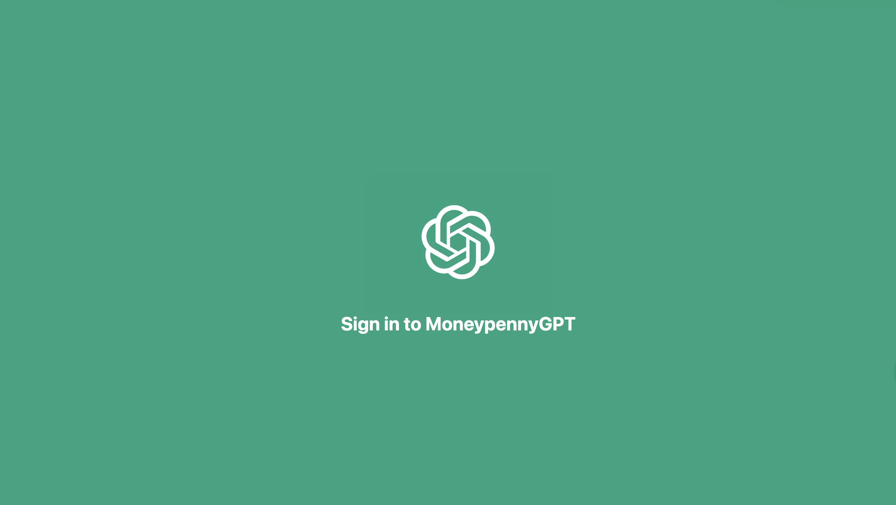

# MoneyPennyGPT-ChatGPT Clone

Reproduction of ChatGPT.
Later will evolve into something bigger.

This project was bootstrapped with [Next JS](https://beta.nextjs.org/docs).

## Author

Anthony COLAS

## Technologies

- 
- 
- 
- 

## Preview

## Installation

### Prerequisites

- npm
- yarn
- Node.js

### How to install?

#### Install via yarn / npm

Clone the backend repository of MoneypennyGPT
`https://github.com/ToDestiny/MoneypennyGPT`

Go inside the installed repository and install dependencies:
`yarn install` or `npm install`

Launch the backend on port 3000 (by default):
`yarn run dev` or `npm run dev`

#### Accessing the website

Frontend is now rendered at URL `http://localhost:3000/`

You can find a production version on vercel: `https://moneypenny-gpt.vercel.app/`

If you need information, you can reach me via GitHub.
